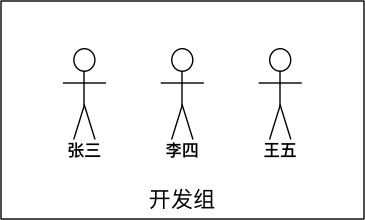

## 初识 Linux 
### 操作系统概述

#### 计算机由硬件和软件组成：

- 硬件：计算机系统中由电子，机械和光电元件等组成的各种物理装置的总称。


- 软件：是用户和计算机硬件之间的接口和桥梁，用户通过软件与计算机进行交流。


> 操作系统，是电脑上最基础的软件
>
> 操作系统就是一个协调、管理和控制计算机硬件资源和软件资源的控制程序


**操作系统（OS）是管理计算机硬件与软件资源的软件。它提供了用户与计算机交互的界面，并且负责以下几方面的核心功能：**

1. **资源管理**：操作系统管理和分配处理器、内存、磁盘空间等计算资源。
2. **文件管理**：提供文件的存储、访问、修改等功能，管理文件系统的结构。
3. **任务调度**：管理多个程序或进程的执行，包括进程创建、执行、暂停和终止。
4. **设备控制**：控制和管理输入/输出设备，如键盘、鼠标、打印机等。
5. **用户界面**：提供用户与计算机交互的界面，如命令行或图形用户界面（GUI）。


#### 不同应用领域的主流操作系统

> 不同领域的操作系统根据其应用环境和设计目标的不同，具有各自的特点和功能。以下是几个主要领域的操作系统： 

**桌面操作系统**：面向个人电脑用户，注重用户界面、多媒体体验和应用软件支持。常见的桌面操作系统包括 `Microsoft Windows`、`macOS`、`Linux` **发行版**（如 `Ubuntu`）等。 

**服务器操作系统**：为服务器设计，强调稳定性、安全性和高性能。常用的服务器操作系统有 `Linux` 的各种 **发行版**（如 `CentOS`、`Debian`）、`Windows Server` 等。 

**嵌入式操作系统**：用于嵌入式系统和设备中，如智能家电、汽车电子、工业控制系统。这些操作系统通常资源占用小，实时性强。例子包括 `RTOS`（实时操作系统）、`VxWorks`、嵌入式 `Linux` 等。

**移动操作系统**：专为移动设备如智能手机和平板电脑设计，优化了触控界面和低功耗。主要的移动操作系统有 `Android`、`iOS`、`HarmonyOS` 等。 每种类型的操作系统针对其应用场景，提供了特定的功能和优化，以满足不同用户和设备的需求。


### 认识 Linux

> Linux 操作系统的创始人是 **Linus Torvalds(林纳斯·托瓦兹)**。他是一位芬兰计算机程序员，于 1991 年创建了 Linux 内核。当时，他只是一个大学生，他的目标是创建一个类 Unix 操作系统，这个系统可以在个人计算机上运行。他发布了 Linux 内核的第一个版本，并开放源代码，逐渐吸引了全球的程序员共同参与开发，形成了 Linux 操作系统的开放源代码社区。后来经过全世界网友的支持, 现在能够兼容多种硬件，成为最为流行的服务器操作系统之一。


#### Linux 系统由以下几个主要组成部分构成：

1. **内核（Kernel）**：`Linux内核是操作系统的核心`，负责管理系统的硬件资源（如 CPU、内存、设备等），提供进程管理、文件系统、网络功能等核心功能。
2. **Shell**：Shell 是用户与 Linux 内核之间的接口，用户通过 Shell 与系统进行交互。Linux 中常用的 Shell 包括 Bash（Bourne Again Shell）、Zsh、Fish 等，它们提供了命令行解释器、脚本编程环境等功能。
3. **GNU 工具集**：GNU 工具集是一套由自由软件基金会（Free Software Foundation）开发的基本命令行工具，包括文件处理工具（如 ls、cp、mv）、文本处理工具（如 grep、sed、awk）、编译工具（如 gcc）等。
4. **文件系统**：Linux 支持多种文件系统，包括常见的 ext4、XFS、Btrfs 等，它们负责管理存储设备上的数据，提供文件存储和访问功能。
5. **系统库（Libraries）**：系统库是一组供应用程序使用的函数和工具集合，包括标准 C 库（libc）、动态链接库（shared libraries）等。
6. **用户界面**：Linux 系统可以提供多种用户界面，包括命令行界面（CLI）和图形用户界面（GUI）。常见的图形用户界面包括 GNOME、KDE、Xfce 等。
7. **应用程序**：Linux 系统支持各种各样的应用程序，包括办公套件、开发工具、网络应用、媒体播放器等，用户可以根据自己的需求选择安装和使用。


#### Linux 发行版

**Linux 内核** 

> 内核是 Linux 操作系统最核心的所在，系统级应用程序只是锦上添花。Linux 内核是免费开源的，任何人都可以下载内核源码并查看且修改。

**Linux 发行版**

> 内核是免费、开源的，这也就代表了：任何人都可以获得并修改内核，并且自行集成系统级程序提供了内核+系统级程序的完整封装，称为 Linux 发行版

**目前市面上由非常多的 Linux 发行版，常用的、知名的如下：**


#### 虚拟机

> 借助虚拟化技术，我们可以在系统中，通过软件：模拟计算机硬件，并给虚拟硬件安装真实的操作系统。

#### VMware WorkStation 安装

> 略...

#### VMware 中安装 Linux 

> 略...

#### 远程连接 Linux 系统

对于操作系统的使用，有两种使用形式：

- **图形化**：使用操作系统提供的图形化页面，以获得图形界面的形式去使用操作系统。
- **命令行**：使用操作系统提供的各类命令，以命令的形式去使用操作系统。

> 尽管图形化是大多数人使用计算机的第一选择，但是在 Linux 操作系统上，这个选择被反转了。无论是企业开发亦或是个人开发，使用 Linux 操作系统，多数都是使用命令行。

这是因为 Linux 主要使用在服务器领域，Linux 从诞生至今，在图形化页面的优化上，并未重点发力。所以 Linux 操作系统的图形化页面：不好用、不稳定。在开发中，使用命令行形式，效率更高，更加直观，并且资源占用低，程序运行更稳定。


## Linux 的目录结构

Linux 的目录结构是一个树型结构 Windows 系统可以拥有多个盘符, 如 C 盘、D 盘、E 盘 Linux 没有盘符这个概念, 只有一个根目录 `/`, 所有文件都在它下面

> Linux 只有一个顶级目录 `/`
>
> Windows 系统可以有多个顶级目录(盘符)


**各个目录的简要说明如下:**

| 目录     | 描述                                                         |
| -------- | ------------------------------------------------------------ |
| `/`      | 所有文件和目录在 Linux 中都是以根目录作为起始点的。            |
| `/bin`   | 存放系统启动和运行所必需的二进制程序，如 `ls`、`cp` 等。       |
| `/sbin`  | 存放系统管理和维护所需的二进制程序，通常由 root 用户运行。     |
| `/etc`   | 包含系统的所有配置文件。                                     |
| `/dev`   | 包含设备文件，代表系统中的硬件设备，如硬盘、键盘等。         |
| `/proc`  | 虚拟文件系统，存放着系统运行时的进程信息以及其他系统信息。   |
| `/var`   | 用于存储运行时需要改变数据的文件，如日志文件、邮件等。       |
| `/tmp`   | 用于存储临时文件，系统重启时通常会被清空。                   |
| `/usr`   | 用于存储用户级的程序和数据。包含 `/usr/bin`、`/usr/sbin`、`/usr/local`。 |
| `/home`  | 存放普通用户的个人数据和配置文件。                           |
| `/root`  | root 用户的个人数据和配置文件。                               |
| `/boot`  | 包含启动 Linux 系统所需的文件，如内核文件和引导加载程序。      |
| `/lib`   | 存放系统最基本的动态链接共享库，类似于 Windows 的 DLL 文件。     |
| `/opt`   | 通常用于存放第三方应用软件包。                               |
| `/mnt`   | 用于临时挂载文件系统，如 CD-ROM 和 USB 设备。                    |
| `/media` | 用于挂载可移除媒体，如 CD-ROMs、USB 闪存驱动器等。             |


## Linux 基础命令

**Linux 命令的通用格式：**

`command [-options] [parameter]`

> `command`：命令
>
> `option`: 选项
>
> - 当命令中有多个选项时 可以分开写 也可以写在一起
>
>     `command -option1 -option2`
>
>     `command -option1option2`
>
> `parameter`：参数 
>
> ==命令和选项、选项和参数 之间需要有空格(可以是多个) 部分命令的选项也可以放到参数之后==
>
> 除了 `command` 其他都是可选项


### 文件系统导航命令

| 命令  | 对应英文             | 作用                 |
| ----- | -------------------- | -------------------- |
| `ls`  | list                 | 查看指定目录下的内容 |
| `pwd` | print work directory | 查看当前所在目录     |
| `cd`  | change directory     | 切换目录             |

#### `ls`：查看指定目录下的内容

格式: `ls [选项] [参数]`

常用选项：

| 选项 | 描述                                                         |
| ---- | ------------------------------------------------------------ |
| `-a` | 显示所有文件，包括以 `.` 开头的隐藏文件。                      |
| `-l` | 以长格式显示文件列表，包含更多详细信息，如权限、所有者、大小、修改时间等。 |
| `-h` | 以人类可读的格式显示文件大小，如 KB、MB、GB 等。               |
| -r   | 反向排序，以逆序显示文件列表。                               |
| -t   | 按修改时间排序，最新修改的文件显示在列表最前面。             |
| -R   | 递归列出目录及子目录中的文件。                               |
| -F   | 在文件名后面加上标识符，表示文件类型，如斜线表示目录、星号表示可执行文件等。 |

> linux 系统中 以 `.` 开头的文件是隐藏文件 需要加上 -a 选项才能查看

**通配符:**

> 在 linux 中，许多命令都支持使用通配符来匹配文件名模式，以便进行文件操作

| 通配符 | 描述                       |
| ------ | -------------------------- |
| `*`    | 匹配零个或多个字符。       |
| `?`    | 匹配一个字符。             |
| `[ ]`  | 匹配指定范围内的字符。     |
| `{ }`  | 用于生成多个字符串的模式。 |

#### `pwd`：查看当前所在目录

#### `cd`：切换目录

格式: `cd 路径`

> Linux 所有的 **目录** 和 **文件名** 都是大小写敏感的

**路径可以是绝对路径、相对路径和特殊路径**

**绝对路径**: 相对于当前工作目录的路径(最前面不是 `/`)

**相对路径**: 从根目录开始的完整路径(最前面是 `/`)

**特殊路径**: 使用特殊符号表示的特殊目录

| 符号 | 含义                                            |
| ---- | ----------------------------------------------- |
| `~`  | 用户的家目录 (也可以直接 `cd` 切换到用户家目录) |
| `.`  | 当前目录                                        |
| `..` | 上级目录                                        |
| `-`  | 最近工作目录                                    |


### 各种快捷键和小技巧

#### 终端快捷键

| 按键                         | 功能                                             |
| ---------------------------- | ------------------------------------------------ |
| Ctrl  +  c                   | 终端当前操作                                     |
| Ctrl  +  d                   | 退出当前用户                                     |
| `history `                   | 查看历史命令 可通过 `!命令序号` 快速执行历史命令 |
| Ctrl  +  l   /  `cLear`      | 清屏                                             |
| Ctrl  +  a   /   Ctrl  +  <- | 移动到开头                                       |
| Ctrl  +  e   /   Ctrl  + ->  | 移动到末尾                                       |
| Ctrl  +  u                   | 删除光标前的内容                                 |
| Ctrl  +  w                   | 向前删除一个单词                                 |
| Ctrl  +  b   /   <-          | 左移一个字符                                     |
| Ctrl  +  f   /  ->           | 右移一个字符                                     |

#### 其他技巧

- 在敲出 `文件` ／ `目录` ／ `命令` 的前几个字母之后，按下 `tab` 键
    - 如果输入的没有歧义，系统会自动补全
    - 如果还存在其他 `文件` ／ `目录` ／ `命令`，再按一下 `tab` 键，系统会提示可能存在的命令

- 按 `上` ／ `下` 键可以在曾经使用过的命令之间来回切换


### 文件和目录操作

| 目录    | 对应英文         | 作用                                   |
| ------- | ---------------- | -------------------------------------- |
| `mkdir` | make directory   | 创建目录                               |
| `rmdir` | remove directory | 删除空目录                             |
| `touch` | touch            | 创建空文件或更新文件的访问和修改时间戳 |
| `rm`    | remove           | 删除文件或目录                         |
| `cp`    | copy             | 复制文件或目录                         |
| `mv`    | move             | 移动或重命名文件或目录                 |


#### `mkdir`：创建目录

格式: `mkdir [选项] [参数]`

常用选项:

| 选项 | 描述         |
| ---- | ------------ |
| `-p` | 递归创建目录 |

#### `rmdir`：删除空目录

#### `touch`：创建空文件

格式: `touch 文件名`

* 如果文件 **不存在**，可以创建一个空白文件
* 如果文件 **已经存在**，可以修改文件的末次修改日期


#### `rm`：删除文件或目录

格式: `rm [选项] [参数]`

> 使用 `rm` 命令要小心，因为文件删除后不能恢复 (删除重要文件时 可以先进行备份)

常用选项:

| 选项 | 含义                                                  |
| ---- | ----------------------------------------------------- |
| `-f` | 强制删除，忽略不存在的文件，无需提示                  |
| `-r` | 递归地删除目录下的内容，**删除文件夹** 时必须加此参数 |
| `-i` | 删除前进行提示                                        |
| -d   | 删除空文件夹                                          |
| -v   | 显示删除过程                                          |


#### `cp`：复制文件或目录

格式: `cp [选项] [文件] [目标路径]` 

常用选项：

| 选项 | 含义                                                         |
| ---- | ------------------------------------------------------------ |
| `-i` | 覆盖文件前提示                                               |
| `-r` | 若给出的源文件是目录文件，则 cp 将递归复制该目录下的所有子目录和文件，目标文件必须为一个目录名 |


#### `mv`：移动或重命名文件或目录

格式: `mv [选项] [文件] [目标路径]`

> 如果目标路径存在 就是移动 否则就是重命名

常用选项:

| 选项 | 描述           |
| ---- | -------------- |
| `-i` | 覆盖文件前提示 |
| `-f` | 强制覆盖       |


### 帮助命令

| 命令                                     | 作用                                                         |
| ---------------------------------------- | ------------------------------------------------------------ |
| `man`                                    | Linux 下的帮助指令                                            |
| `info`                                   | Linux 下 info 格式的帮助指令                                    |
| `--help 选项`                            | 很多命令都具备 `--help` 选项 可以获取命令的帮助信息          |
| [在线命令搜索](https://cmd.swsw.eu.org/) | [一个开源项目, 感兴趣的可以自己部署](https://github.com/jaywcjlove/linux-command) |


### 查看文件

| 命令            | 作用             |
| --------------- | ---------------- |
| `cat`           | 查看文件内容     |
| `more` / `less` | 分页查看文件内容 |
| `head`          | 查看文件开头部分 |
| `tail`          | 查看文件末尾部分 |


#### `cat`：查看文件内容

格式: `cat [选项] [参数]`

常用选项:

| 选项 | 描述               |
| ---- | ------------------ |
| `-b` | 对非空输出行编号   |
| `-n` | 对输出的所有行编号 |

#### `more` / `less`：分页查看文件内容

#### `head`: 查看文件开头部分

格式: `head [选项] [参数]`

> 未指定行数时默认显示前 10 行

常用选项:

| 选项 | 描述                          |
| ---- | ----------------------------- |
| `-n` | 显示前 `n` 行而不是默认的 10 行 |


####  `tail`: 查看文件后 n 行 

格式: `tail [选项] [参数]`

> 未指定行数时默认显示前 10 行

常用选项:

| 选项 | 描述                                                         |
| ---- | ------------------------------------------------------------ |
| `-n` | 显示后 `n` 行而不是默认的 10 行                                |
| `-f` | 显示文件最新追加的内容 可用于监控日志文件                    |
| `-F` | 同上 不断地检查文件是否被删除或移动，并在文件被重新创建或移回时重新打开文件 (如果文件被删除或重命名，`tail -f` 会停止并报错) |

### 压缩、解压

`.tar.gz`

压缩:

`tar -zcvf 压缩文件.tar.gz 被压缩的文件／路径...`

解压缩:

`tar -zxvf 压缩文件.tar.gz -C 解压路径`

 

`.zip`

压缩

`zip -r 压缩文件.zip 被压缩的文件／路径...`

解压缩

`unzip -d 解压路径 `


### 其他

| 命令  | 描述                                                       |
| ----- | ---------------------------------------------------------- |
| `wc`  | 统计文件的行数 单词数 字节数                               |
| `cut` | 用来显示行中的指定部分 (`-f` 表示要取的列 `-d` 表示分隔符) |


## `vi`/`vim` 文本编辑器的使用

> `vi/vim` 文件名
>
> `vi/vim` 文件名打开文件 如果文件不存在 会自动创建

### `vi/vim` 编辑器的主要三种工作模式

- **普通模式**
- **插入模式**
- **命令行模式**


### `vim` 编辑器快捷键

**移动命令**

| 命令 | 描述                             |
| -------------------------------- | -------------------------------- |
| `i`  | 在当前光标位置进入 `插入模式`     |
| `I`  | 在当前行的开头进入 `插入模式`     |
| `a`  | 在当前光标位置之后进入 `插入模式` |
| `A`  | 在当前行的结尾进入 `插入模式`     |
| `o`  | 在当前光标下一行进入 `插入模式`   |
| `O`  | 在当前光标上一行进入 `插入模式`   |
| `h`        | 光标左移         |
| `j`        | 光标下移         |
| `k`        | 光标上移         |
| `l`        | 光标右移         |
| `w`        | 移动到下一个单词 |
| `b`        | 移动到上一个单词 |
| `0`        | 移动到行首       |
| `$`        | 移动到行尾       |
| `gg`       | 移动到开头       |
| `G`        | 移动到结尾       |
| `H`        | 移动到屏幕顶部   |
| `M`        | 移动到屏幕中部   |
| `L`        | 移动到屏幕底部   |
| `mgg`     | m 是数字 跳转到第 m 行 |
| `ctrl + f` | 向下滚动一屏     |
| `ctrl + b` | 向上滚动一屏     |


**复制、剪切**

| 快捷键     | 功能                |
| ---------- | ------------------- |
| `yy`       | 复制当前行          |
| `myy`      | m 是数字 向下复制 m 行 |
| `dd`       | 剪切当前行          |
| `mdd`      | m 是数字 向下剪切 m 行 |
| `p`        | 在光标后粘贴        |
| `u`        | 撤销                |
| `ctrl + r` | 重做                |

**查找和替换**

| 快捷键           | 功能                              |
| ---------------- | --------------------------------- |
| `/word`          | 向下查找 `word` 字符串            |
| `?word`          | 向上查找 `word` 字符串            |
| `n`              | 查找下一个匹配项                  |
| `N`              | 查找上一个匹配项                  |
| `noh`            | 移除搜索结果高亮                  |
| `:%s/old/new/g`  | 在全文中将所有 `old` 替换为 `new` |
| `:%s/old/new/gc` | 在全文中逐个将 `old` 替换为 `new` |

> 替换操作中 可以指定范围 
>
> - `%` 表示全部 
> - `.或不写` 表示当前行 
> - `m,n` 表示 m-n 行
> - `g` 表示全局替换
> - `gc` 表示逐个替换 (单独的 `c` 会进行提示)
> - `/` 表示边界符 也可以使用其他的 (如: `@` `#`)


**其他操作**

| 命令              | 功能             |
| ----------------- | ---------------- |
| `:set nu`         | 设置显示行号     |
| `:set nonu`       | 取消显示行号     |
| `:syntax on`      | 开启语法高亮     |
| `:syntax off`     | 关闭语法高亮     |
| `:w`              | 保存当前文件     |
| `:q`              | 退出当前文件     |
| `:q!`, `ZQ`       | 不保存并强制退出 |
| `:wq`, `:x`, `ZZ` | 保存并退出       |


## 其他常用命令

### 查找命令

| 命令                       | 描述                                                         |
| -------------------------- | ------------------------------------------------------------ |
| `which`                    | 查找并显示给定命令的绝对路径                                 |
| `find [路径] -name "*.py"` | 在指定目录下查找文件(`-name` 根名字查找 `-type` 根据文件类型查找) |
| `locate`                   | 文件查找工具                                                 |
| `grep`                     | 查找文本                                                     |

`grep` 允许对文本文件进行 **模式(正则表达式)** 查找

常用选项:

| 选项 | 含义                                     |
| ---- | ---------------------------------------- |
| `-n` | 显示匹配行及行号                         |
| `-v` | 显示不包含匹配文本的所有行（相当于求反） |
| `-i` | 忽略大小写                               |
| `-E` | 使用扩展的正则表达式                     |
| `-c` | 统计文件中匹配的行数                     |

### 管道和重定向

管道: `|`

* Linux 允许将 **一个命令的输出** 可以 **通过管道** 做为 **另一个命令的输入**
* 可以理解现实生活中的管子，管子的一头塞东西进去，另一头取出来，这里 `|` 的左右分为两端，左端塞东西（写），右端取东西（读）
* 管道通常会和其他命令一起使用

重定向: 

- 重定向就是将数据传输到其他地方
- Linux 允许将命令的执行结果重定向到一个文件，也允许将文件的内容重定向为命令的输入

| 命令    | 说明           |
| ------- | -------------- |
| >       | 输出覆盖重定向 |
| >>      | 输出追加重定向 |
| < 或 << | 标准输入重定向 |

输出重定向:

- `>` 表示覆盖，会覆盖文件原有的内容
- `>>` 表示追加，会将内容追加到已有文件的末尾

```bash
command > log.out 2>&1 
```


输入重定向:

- `<` 将文件内容重定向为命令的输入
- `<<`：允许你在命令行中嵌入多行输入，通常用于创建临时输入

### 硬链接和软链接

`ln`

> 硬链接和软链接都是在文件系统中创建文件链接的方法，它们允许一个文件可以通过多个路径访问

- 硬链接是指针指向文件数据块的实际物理链接，多个文件指向同一数据块。在文件系统中，每个文件都有一个索引节点（inode），硬链接实际上是在文件系统中为不同的文件名分配相同的索引节点号码, 无法为目录创建硬链接 **工作中几乎不会建立文件的硬链接**

- 软链接是一个特殊的文件，它包含指向目标文件或目录的路径名。在文件系统级别，软链接包含指向目标的路径，而不是实际的数据块 **源文件尽量使用绝对路径**，不要使用相对路径，这样可以方便移动链接文件后，仍然能够正常使用


### 后台运行

**使用 `&` 符号**

在命令的末尾添加 `&` 符号，这样命令将在后台运行

`command &` 

**使用 `nohup` 命令**

`nohup command &`

> `nohup` 命令可以使命令忽略挂起信号，从而使命令在后台运行，并且即使关闭终端或退出当前会话，命令也不会被终止
>
> `nohup` 命令会将输出重定向到文件 `nohup.out`


### 定时任务

`crontab`

| 选项 | 描述                       |
| ---- | -------------------------- |
| `-e` | 编辑当前用户的定时任务列表 |
| `-l` | 查看当前用户的定时任务列表 |
| `-r` | 查看当前用户的定时任务列表 |

[crontab 验证](https://tool.lu/crontab/)


### 软件安装

 `yum` (需要 `root` 权限)

> `yum` 命令可以在终端中方便的 **安装** ／ **卸载** ／ **更新软件包**

- 安装

    `yum install 软件包`

- 卸载

    `yum remove 软件名`

- 更新软件包

    `yum upgrade `


## 用户权限相关命令

> * **用户** 是 Linux 系统工作中重要的一环，用户管理包括 **用户** 与 **组** 管理
> * 在 Linux 系统中，不论是由本机或是远程登录系统，每个系统都 **必须拥有一个账号**，并且 **对于不同的系统资源拥有不同的使用权限**
> * 在 Linux 中，可以指定 **每一个用户** 针对 **不同的文件或者目录** 的 **不同权限**

对 **文件／目录** 的权限包括：

| 权限 |  英文  | 缩写 | 数字代号 |
| :--: | :----: | :--: | :------: |
|  读  |  read  |  r   |    4     |
|  写  | write  |  w   |    2     |
| 执行 | excute |  x   |    1     |

### 组

* 为了方便用户管理，提出了 **组** 的概念，如下图所示



* 在实际应用中，可以预先针对 **组** 设置好权限，然后 **将不同的用户添加到对应的组中**，从而 **不用依次为每一个用户设置权限**

### ls -l 扩展

> `ls -l` 可以查看文件夹下文件的详细信息，从左到右依次是

* **文件类型和权限**，第一个字符表示文件类型，后面的九个字符表示权限

    * `-`：普通文件
    * `d`：目录
    * `l`：符号链接（软链接）

    后面的字符表示权限

    - `r`：读权限
    - `w`：写权限
    - `x`：执行权限
    - `-`：无权限

* **硬链接数**，通俗地讲，就是有多少种方式，可以访问到当前目录／文件

* **所有者**，家目录下 文件／目录 的拥有者通常都是当前用户

* **所属组**，在 Linux 中，很多时候，会出现组名和用户名相同的情况，后续会讲

* **大小**, 文件的大小（以字节为单位），对于目录，则显示目录中包含的文件数

* **日期和时间**, 文件或目录的最后修改时间

* **文件名或目录名**：文件或目录的名称


### 超级用户

* Linux 系统中的 `root` 账号通常 **用于系统的维护和管理**，对操作系统的所有资源 **具有所有访问权限**
* 在大多数版本的 Linux 中，都不推荐 **直接使用 root 账号登录系统**
* 在 Linux 安装的过程中，系统会自动创建一个用户账号，而这个默认的用户就称为“标准用户”

### 用户切换

* `su` 是 `substitute user` 的缩写，表示 **使用另一个用户的身份**

    格式: `su - 用户名`

* `sudo` 命令用来以其他身份来执行命令，预设的身份为 `root`

    格式: `sudo command`

    用户使用 `sudo` 时，必须先输入密码


### 用户管理

> **创建用户** / **删除用户** / **修改其他用户密码** 的终端命令都需要 `root` 权限

#### 用户、用户组管理

用户组操作:

- 创建用户组 `groupadd 用户组名`

- 删除用户组 `groupdel 用户组名`

- 查看用户组信息 `cat /etc/group`

    > 组名称: 组认证(显示为 x): 组 ID

用户操作:

- 创建用户 `useradd [-g] 用户名`

    > -g 指定用户的组，不指定-g，会创建同名组并自动加入

- 修改密码 `passwd 用户名`

- 删除用户 `userdel [-r] 用户名`

    > -r，删除用户的家目录

- 查看用户信息 `cat /etc/passwd`

    > 用户名: 密码(x): 用户 ID: 组 ID: 描述信息(无用): HOME 目录: 执行终端(默认 bash)

- 查看用户所属组 `id [用户名]`

- 修改用户的主组 (GID) `usermod -g 组 用户名`

- 修改用户的附加组 `usermod -G 组 用户名`


### 权限管理

#### 修改文件权限 (掌握)

`chmod`

- 符号方式

```bash
chmod [-R] a=rw 文件|目录
# user：u，group：g，other：o，all：a
# read：r，write：w，execute：x
# 赋予权限的方式 , 添加：+，减掉：-，设定：=
# -R： 当修改一个目录权限时，可以添加-R，将目录下的全部内容，都修改权限。
```

- 数字方式

```bash
chmod [-R] 777 文件|目录
# rwx在这三个权限中r：4，w：2，x：1
# -R： 当修改一个目录权限时，可以添加-R，将目录下的全部内容，都修改权限。
```


#### 修改文件或目录所属的用户组

`chgrp [-R] 组名 文件名|目录名`

#### 修改文件或目录的拥有者或所属群组

`chown [-R] [用户]:[用户组] 文件或目录`


## 系统管理命令

### 系统信息

#### 时间和日期

`date` 查看系统的时间

`date [-d] +格式化字符串`  (%Y-%m-%d  %H:%M:%S)

-d 选项，可以按照给定的字符串显示日期，一般用于日期计算

```bash
# 时间加减操作：
date +%Y-%m-%d                   # 显示年月日
date -d "+1 day" +%Y-%m-%d       # 加一天
date -d "-1 day" +%Y-%m-%d       # 减一天

其他: month year
```


### 进程信息

| 命令               | 描述                       |
| ------------------ | -------------------------- |
| `ps -ef`           | 查看进程                   |
| `kill [-9] 进程号` | 关闭进程 `-9` 表示强制杀死 |
| `top`              | 查看 CPU、内存使用情况     |

```bash
ps -ef 
------------------------------------
UID：进程所属的用户 ID
PID：进程的进程号 ID
PPID：进程的父 ID（启动此进程的其它进程）
C：此进程的 CPU 占用率（百分比）
STIME：进程的启动时间
TTY：启动此进程的终端序号，如显示?，表示非终端启动
TIME：进程占用 CPU 的时间
CMD：进程对应的名称或启动路径或启动命令
```

```bash
top
-----------------------------------
PID：进程的唯一标识符。
USER：启动进程的用户名。
PR：进程的优先级。
NI：进程的优先级调整值，负值表示高优先级，正值表示低优先级。
VIRT：进程使用的虚拟内存大小。
RES：进程占用的实际物理内存大小（常驻内存）。
SHR：进程使用的共享内存大小。
S：进程的状态，常见的状态有 R（运行）、S（睡眠）、D（不可中断的睡眠状态）、Z（僵尸进程）等。
%CPU：进程占用 CPU 的百分比。
%MEM：进程占用内存的百分比。
TIME+：进程已经运行的 CPU 时间。
COMMAND：进程的命令名称。
```


### 磁盘信息

| 命令             | 描述                                             |
| ---------------- | ------------------------------------------------ |
| `df -h`          | `disk free` 显示磁盘剩余空间 (`-s` 显示指定目录) |
| `du -h [目录名]` | `disk usage` 显示目录下的文件大小                |


### 关机/重启

| 命令              | 描述 |
| ----------------- | ---- |
| `shutdown -h now` | 关机 |
| `shutdown -r now` | 重启 |
| `reboot`          | 重启 |


## 网络管理和文件传输

### 网络配置和诊断

| 命令       | 描述                                         |
| ---------- | -------------------------------------------- |
| `ifconfig` | 可以查看／配置计算机当前的网卡配置信息       |
| `ping`     | 检测当前计算机到目标计算机之间的网络是否通畅 |

### 文件传输

| 命令   | 描述                                             |
| ------ | ------------------------------------------------ |
| `wget` | 下载网络文件                                     |
| `curl` | 发送 http 网络请求，可用于：下载文件、获取信息等 |

###  远程登录和复制文件

| 命令                                                | 描述         |
| --------------------------------------------------- | ------------ |
| `ssh` 用户名@ip                                     | 远程登录     |
| `scp` 用户名@ip: 文件名或路径 用户名@ip: 文件名或路径 | 远程复制文件 |

#### 其他

| 命令             | 描述                                          |
| ---------------- | --------------------------------------------- |
| `netstat -tnulp` | 查看端口信息 可配合 `grep` 命令查看端口占用情况 |
| `lsof -i:端口号` | 查看端口占用情况                              |


