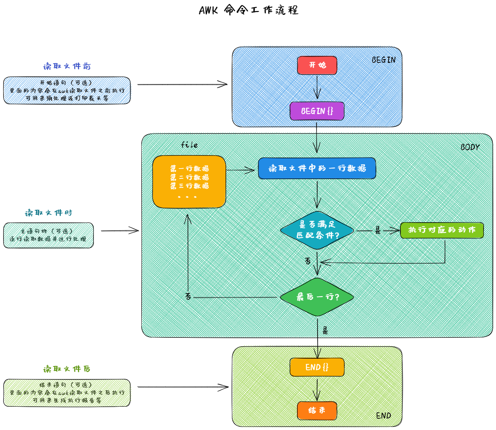

---
tags:
  - linux
---
# awk 文本分析工具

=== "说明"
    !!! note "说明"
        `awk` 是一种编程语言，用于在linux/uniⅸ下对文本和数据进行处理。数据可以来自标准输入(stdin)、一个或多个文件，或其它命令的输出。它支持用户自定义函数和动态正则表达式等先进功能，是linux/unix下的一个强大编程工具。它在命令行中使用，但更多是作为脚本来使用。`awk` 有很多内置的功能，比如数组、函数等，这是它和C语言的相同之处，灵活性是 `awk` 最大的优势。

=== "语法"
    !!! abstract "语法"
        ```shell
        awk [option] 'PATTERN{ACTION STATEMENTS}' FILE
        ```

## awk 执行过程 




## awk 程序结构

| 结构                      | 解释                                                                                   |
| ------------------------- | -------------------------------------------------------------------------------------- |
| BEGIN{ awk-commands }     | 可省略，里面的内容在awk读取文件之前执行                                                |
| /pattern/{ awk-commands } | 可省略，对于输入的每一行，都会执行一次该部分代码，可以添加 /parttern/ 对输入行进行过滤 |
| END{ awk-commands }       | 可省略，里面的内容在awk读取文件完毕之后执行                                            |

### 示例

```shell
# 准备如下文本内容
[root@localhost ~]# cat emp.txt 
001 张三 1000 10
002 李四 2000 10
003 王五 3000 10
004 赵六 2000 20
005 小红 1800 30
006 小丽 800  20

# 用awk命令输出文本内容
[root@localhost ~]# awk '{print}' emp.txt

# 输出文本内容，添加表头和表的结尾（-------------------）
[root@localhost ~]# awk 'BEGIN{print "编号 姓名 工资 部门"}{print}END{print "-------------------"}' emp.txt
编号 姓名 工资 部门
001 张三 1000 10
002 李四 2000 10
003 王五 3000 10
004 赵六 2000 20
005 小红 1800 30
006 小丽 800  20
-------------------
```


## awk 命令选项

| 选项          | 含义                                                         |
| ------------- | ------------------------------------------------------------ |
| -F fs         | 指定输入文件分隔符（默认是空白字符），fs是一个字符串或者是一个正则表达式 |
| -v var=value  | 赋值一个用户定义变量                                         |
| -f scriptfile | 从脚本文件中读取awk命令                                      |

???+ tip "awk 使用方式" 
    === "命令行使用"
        - 直接在命令行里执行 `awk` 命令
        ```shell 
        awk '{print}' emp.txt
        ```

    === "awk 脚本使用"
        - 将awk代码写在文件里（一般以.awk为文件扩展名）,通过 -f 选项执行
        ```shell 
        awk -f file.awk emp.txt
        ```
    === "shell 脚本使用"
        - 将awk命令写到shell脚本里，执行shell脚本


## awk 模式和操作

| 模式           | 含义                        |
| -------------- | --------------------------- |
| /pattern/     | 正则表达式                  |
| 关系表达式     | 使用运算符进行操作          |
| 模式匹配表达式 | ~ （匹配）    !~ （不匹配） |

???+ quote 
    操作可以由一个或多个命令、函数、表达式组成，之间由换行符或分号隔开

    awk 正则范围：
    
    - `/start/,/end/`
    - `NR==1,NR==5` 从第 1 行开始第 5 行结束


### 示例

```shell
# 输出emp.txt包含'小'字的行
[root@localhost ~]# awk '/小/' emp.txt

# 输出从包含'张'的行开始到包含'赵'的行结束
[root@localhost ~]# awk '/张/,/赵/' emp.txt

# 输出前三行
[root@localhost ~]# awk 'NR<=3' emp.txt
[root@localhost ~]# awk 'NR==1,NR==3' emp.txt
[root@localhost ~]# awk 'NR>=1 && NR<=3' emp.txt

# 模式匹配则输出
[root@localhost ~]# awk '666 ~ /[0-9]+/' emp.txt
```

> 当使用模式后，如果只是输出行，`awk` 语句部分可省略


## awk 变量

### 内置变量（预定义变量）

| 变量     | 含义                                             |
| -------- | ------------------------------------------------ |
| $0       | 执行过程中当前行的内容                           |
| $n       | 当前记录的第n个字段（分割后的第n列）             |
| NF       | 当前行的字段数，$NF 表示一行中最后一个字段       |
| NR       | 当前行的行号                                     |
| FS       | 输入字段分隔符（默认是空白字符，可使用-v指定）   |
| OFS      | 输出字段分隔符（默认是一个空格，可使用-v指定）   |
| RS       | 输入记录分隔符（默认是一个换行符，可使用-v指定） |
| ORS      | 输出记录分隔符（默认是一个换行符，可使用-v指定） |
| FILENAME | 当前文件的文件名                                 |


### 自定义变量

- 使用-v选项定义
```shell 
-v var=value
```

- 在 `awk` 程序中定义
```shell 
awk 'BEGIN{var=value}'
```


### 传递外部变量

- 使用 `-v` 选项可以给 `awk` 命令传递一个外部变量

- 在命令最后使用 `var=value` 也可以传递一个外部变量


### 示例

```shell
# 打印emp.txt每一行的内容、行号和字段数
[root@localhost ~]# awk '{print $0,NR,NF}' emp.txt

# 打印第1列、最后一列和倒数的2列的内容
[root@localhost ~]# awk '{print $1,$NF,$(NF-1)}' emp.txt

# 将文本内容按照 "部门 编号 姓名 工资" 的顺序输出
[root@localhost ~]# awk '{print $4,$1,$2,$3}' emp.txt

# 输出第3行的第2个字段 
[root@localhost ~]# awk 'NR==3{print $2}' emp.txt

# 统计每个部门的人数 
[root@localhost ~]# awk '{print $NF}' emp.txt | uniq -c

# 将输出字段分隔符修改为':' 并把输出结果写入emp.txt.bak文件 
[root@localhost ~]# awk -v OFS=":" '{print $1,$2,$3,$4}' emp.txt > emp.bak.txt
[root@localhost ~]# awk -v OFS=":" 'NF=NF' emp.txt > emp.bak.txt

# 针对emp.txt.bak文件每一行数据，输出: "编号：xxx，姓名：xxx，工资：xxx"
[root@localhost ~]# awk -F: '{print "编号："$1"，姓名："$2"，工资："$3}' emp.bak.txt

# 自定义变量
# 方式一
[root@localhost ~]# echo | awk -v a=100 '{print a}'
# 方式二
[root@localhost ~]# echo | awk 'BEGIN{b=100;print b}'

# 传递外部变量
[root@localhost ~]# a='aaa'
[root@localhost ~]# b='bbb'
# 方式一
[root@localhost ~]# echo | awk -v v1=$a -v v2=$b '{print v1,v2}'
# 方式二
[root@localhost ~]# echo | awk '{print v1,v2}' v1=$a v2=$b
```

???+ quote 
    - `print` 的参数以逗号分隔时，打印时以空格作为分隔符；`awk` 中 `print` 语句的引号被作为拼接符使用
    - 要使 `OFS` 变量生效，必须对字段进行操作（可以设置 `NF=NF`，`NF+=0`，`$1=$1` ...）


## 格式化打印（printf）

- 使用方式和C语言的 `printf` 一样
- `print` 显示结果时以逗号分隔，结果会自动将这些内容用分隔符进行分隔，并且不需要添加换行符；
- `printf` 可以控制某一个字段的输出格式，需要手动添加换行符

<br>

**常用格式替换符：**

| 符号 | 解释       |
| ---- | ---------- |
| %s   | 字符串     |
| %f   | 浮点数     |
| %d   | 十进制整数 |
| %c   | ASCII字符  |
| %%   | %本身      |


**常用转义字符：**

| 符号 | 解释       |
| ---- | ---------- |
| \n   | 换行       |
| \t   | 水平制表符 |
| \v  | 垂直制表符 |
| \r   | 回车       |
| \b   | 后退       |
| \f   | 换页       |
| \a   | 警告字符   |
| \\\\\  | \本身      |