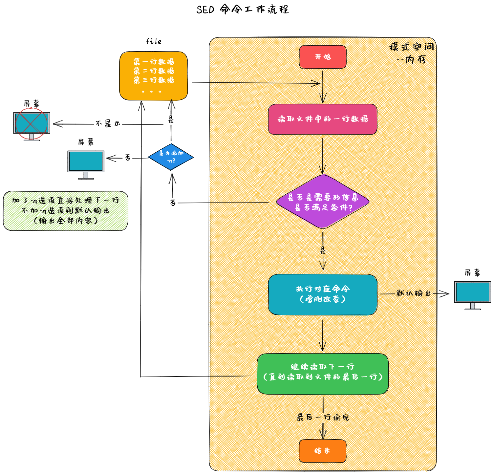

---
tags:
  - linux
---
# sed 流编辑器

=== "说明"
    !!! note "说明"
        `sed` 是一种流编辑器，它是文本处理中非常重要的工具，能够完美的配合正则表达式使用，功能不同凡响。处理时，把当前处理的行存储在临时缓冲区中，称为“模式空间”(pattern space)，接着用 `sed` 命令处理缓冲区中的内容，处理完成后，把缓冲区的内容送往屏幕。接着处理下一行，这样不断重复，直到文件末尾。文件内容并没有改变，除非你使用重定向存储输出。`sed` 主要用来自动编辑一个或多个文件；简化对文件的反复操作；编写转换程序等。

=== "语法"
    !!! abstract "语法"
        ```shell 
        sed [OPTION]... {script-only-if-no-other-script} [input-file]...
        ```

## sed 执行过程



## sed 命令选项

| 选项 | 作用                                                         |
| ---- | ------------------------------------------------------------ |
| -n   | 取消默认 sed 输出，只输出处理后的结果，通常与 p 动作一起使用 |
| -r   | 支持使用扩展正则表达式                                       |
| -i   | 直接编辑文件，不使用 -i ，修改的只是缓冲区的内容             |
| -e   | 多次编辑，和管道符作用一样                                   |
| -f   | 运行sed脚本中的编辑命令                                      |


## sed 编辑命令

| 动作 | 描述                                               |
| ---- | -------------------------------------------------- |
| a\\  | 新增，在当前行下面插入文本 （用 \ 或者空格都可以） |
| i\\  | 插入，在当前行上面插入文本                         |
| c\\  | 修改，把选定行修改为新的文本                       |
| d    | 删除，删除选定行                                   |
| p    | 打印，打印匹配的内容，通常与 -n 选项一起使用       |
| s    | 替换，匹配内容并进行替换，支持正则                 |
| n    | 读取下一个输入行，然后执行下一个命令               |
| w    | 保存模式匹配的行至指定文件                         |
| r    | 读取指定文件的文本至模式空间中匹配到的行后         |
| =    | 为模式空间中的行打印行号                           |
| !    | 模式空间中匹配行取反处理                           |


## sed 替换标记

| 符号 | 描述                                                         |
| ---- | ------------------------------------------------------------ |
| g    | 行内全部替换，不写默认替换每行第一个，ng 表示替换第 n 次开始匹配到的内容 |
| \n   | 子字符串匹配标记；\n表示第几个分组里的内容                   |
| &    | 已匹配字符串标记                                             |

???+ tip  "s 替换命令说明" 
    === "定界符"
        - 替换命令中，常用`/`作为定界符,也可以使用自定义的定界符，如`:`、`#`、`@`等 
        - 定界符出现在内部时，需要进行转义，如 `sed 's:[0-9]:\::' test.txt` 使用 `:`作为定界符，将所有数字替换成`:`

    === "组合多个表达式"
        - sed 替换命令可以结合其他命令一起使用，例如将第一行所有小写字母替换成 `#` 并进行打印
            ```shell 
            sed '1s/[a-z]/#/gp' test.txt
            ```
        - 其他命令也可以组合多个表达式使用，可以有以下三种写法（在同一行里执行多个命令，受先后顺序影响）
            ```shell 
            sed '表达式1' | sed '表达式2'
            sed '表达式1; 表达式2'
            sed -e '表达式1' -e '表达式2'`
            ```
    
    === "子字符串匹配（反向引用）"
        - 匹配给定模式中的一部分，配合`()`分组使用，`\n`就表示匹配第几个分组的结果
    
    === "已匹配字符串"
        - 使用 `&` 来表示匹配到的每一个内容，也可以使用子字符串匹配来实现


## sed 匹配范围

| 范围         | 解释                                                         |
| ------------ | ------------------------------------------------------------ |
| 全文         | 全文处理                                                     |
| 指定行       | 指定文件的某一行 ；'1p' 表示打印第一行                       |
| 指定模式     | /pattern/ 被模式匹配到的每一行； '/^H/' 表示H开头的行        |
| 指定范围区间 | 范围内的每一行；'1,3' 表示第1行到第3行；'1,+2' 表示第1行和后两行；'$'表示最后一行 |
| 指定步长     | 根据步长匹配行；'1~2' 表示 1,3,5,7,... 奇数行； '2~2' 表示2,4,6,8...偶数行 |


> 行范围和模式范围可以组合成范围区间使用


## sed命令示例

```shell
# 打印第5行
[root@localhost ~]# sed -n '5p' test.txt

# 在每一行下面添加文本"day day up"（不修改原文件）
[root@localhost ~]# sed 'a day day up' test.txt

# 在第1行上面添加两行 "abcde" 和 "ABCDE" 
[root@localhost ~]# sed -i '1i abcde\nABCDE' test.txt

# 把最后一行更改为"66666"
[root@localhost ~]# sed -i '$c 66666' test.txt 

# 把所有的字符'A'修改为'a'
[root@localhost ~]# sed -i 's/A/a/g' test.txt 

# 删除前2行
[root@localhost ~]# sed -i '1,2d' test.txt

# 将'H'开头的行写入文件 file.txt 
[root@localhost ~]# sed -n '/^H/w file.txt' test.txt

# 将file.txt文件里的内容写入第5行下面
[root@localhost ~]# sed -i '5r file.txt' test.txt

# 删除'l'开头的下一行
[root@localhost ~]# sed -i '/^l/{n;d;}' test.txt

# 打印2-5行之外的行
[root@localhost ~]# sed -n '2,5!p' test.txt

# 将所有出现一次以上的字母'b'修改成数字'8'打印出来 
[root@localhost ~]# sed -nr 's/b+/8/gp' test.txt

# 在第6行的内容删除 然后修改所有'*'为'#'
[root@localhost ~]# sed -i -e '5d' -e 's/*/#/g' test.txt

# 新建文件file.sed里面书写sed脚本 将test.txt文件中第一行到'?'结尾的行打印出来
[root@localhost ~]# echo "/1,/^A/p" > file.sed 
[root@localhost ~]# sed -n -f file.sed test.txt 

## 后向引用
-- 先保护后使用 

# 将 "hello world" 改成 "[hello] [world]" 
[root@localhost ~]# echo "hello world" | sed -r 's/(\w+)/[\1]/g'
[root@localhost ~]# echo "hello world" | sed -r 's/\w+/[&]/g'

# 将每一行第一次连续出现3次的字符串替换成 ‘嗯哼~’ 
[root@localhost ~]# sed -r -i 's/([a-z])\1\1/嗯哼~/' test.txt

# 获取linux的ip地址 
[root@localhost ~]# ip a s eth0 
9: eth0: <> mtu 1500 group default qlen 1
    link/ether d8:c4:97:92:73:08
    inet 169.254.248.50/16 brd 169.254.255.255 scope global dynamic
       valid_lft forever preferred_lft forever
    inet6 fe80::5219:3165:3e7d:41fb/64 scope link dynamic
       valid_lft forever preferred_lft forever
       
[root@localhost ~]# ip a s eth0 | sed -nr '3s/(^.*t )(.*)(\/.*$)/\2/gp'

# 使用sed命令将任意3个小写字母倒置 例如：'abc'改为'cba'
[root@localhost ~]# echo "abc“ | sed -n 's/([a-z])([0-z])(a-z)/\3\2\1/p' 
```