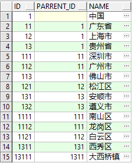
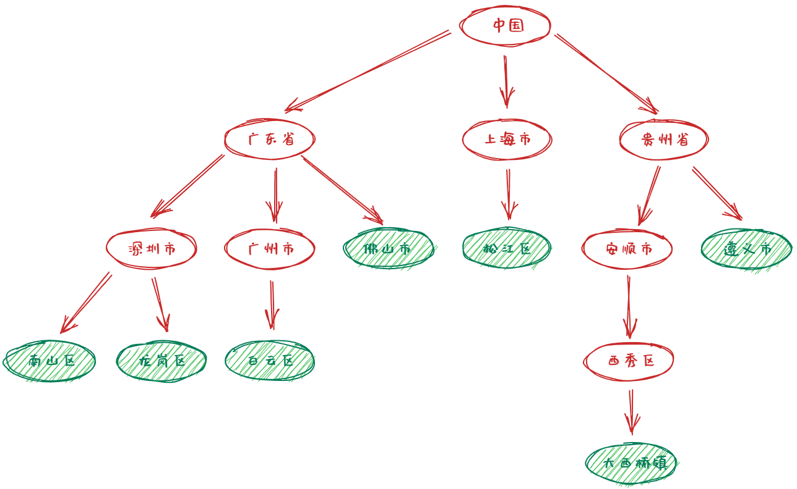
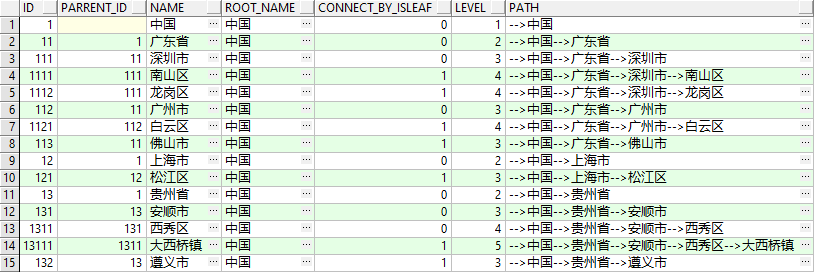
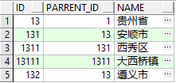

---
tags:
  - sql
  - oracle
---
# 递归查询示例

## 准备数据

```sql
-- 创建表并插入数据
create table t_area(
       id number,
       parrent_id number,
       name varchar2(20)
);

insert into t_area values(1,null,'中国');
insert into t_area values(11,1,'广东省');
insert into t_area values(12,1,'上海市');
insert into t_area values(13,1,'贵州省');
insert into t_area values(111,11,'深圳市');
insert into t_area values(112,11,'广州市');
insert into t_area values(113,11,'佛山市');
insert into t_area values(121,12,'松江区');
insert into t_area values(131,13,'安顺市');
insert into t_area values(132,13,'遵义市');
insert into t_area values(1111,111,'南山区');
insert into t_area values(1112,111,'龙岗区');
insert into t_area values(1121,112,'白云区');
insert into t_area values(1311,131,'西秀区');
insert into t_area values(13111,1311,'大西桥镇');
commit; 

select * from t_area; -- (1)!
```

1.  


表中数据的关系如下图：

## 示例

找出每个地区下面的所有行政区，查询结果将行政区之间的层级关系也进行显示
```sql
select id
       ,parrent_id
       ,name  
       ,connect_by_root name root_name
       ,connect_by_isleaf 
       ,level 
       ,sys_connect_by_path(name,'-->') path 
from t_area t 
start with parrent_id is null 
connect by prior id = parrent_id;  -- (1)
```

1.  

???+ note annotate "说明"
    - `oracle` 中可以使用 `start with xxx connect by prior xxx` 语句实现递归 
    - `prior` 后面一般跟一个等式，可以跟在等式的任意一边
    - `prior` **跟在谁的前面，就是向谁递归**

找出“贵州省”下面的所有行政区

```sql
select id
    ,parrent_id
    ,name
from t_area
start with name = '贵州省' 
connect by prior id = parrent_id;  -- (1)
```

1.  

找出“贵州省”下面的所有市级及以上行政区

```sql
select id
    ,parrent_id
    ,name
from t_area
where level <= 2
start with name = '贵州省' 
connect by prior id = parrent_id;  -- (1)
```

1.    

找出“西秀区”的所有上级行政区

```sql
select id
    ,parrent_id
    ,name
from t_area
start with name = '西秀区' 
connect by id = prior parrent_id;  -- (1)
```

1.    


## 扩展 1


现在不使用 `satrt with connect by` 来实现以下几个需求：


找出“贵州省”下面的所有市级及以上行政区
```sql
select *
from t_area 
where name = '贵州省'
union all
select b.* 
from t_area a,t_area b 
where a.name = '贵州省'
and a.id = b.parrent_id; -- (1)
```

1.  

找出“贵州省”下面的所有区级及以上行政区
```sql
select *
from t_area 
where name = '贵州省'
union all 
select b.*  
from 
  (select *
  from t_area 
  where name = '贵州省'
  union all
  select b.* 
  from t_area a,t_area b 
  where a.name = '贵州省'
  and a.id = b.parrent_id) a
join t_area b
on a.id = b.parrent_id; -- (1)
```

1.  


???+ tip annotate "with 递归查询 (CTE)"
    - 通过 CTE，我们可以创建一组虚拟表，这些表之间可以互相引用，简化递归查询的过程
    - 通过此种方式可以自定义实现更多的功能
    - 此种方式更具备通用性，在很多数据库中都允许使用 CTE 来实现递归查询 


找出“贵州省”下面的所有行政区
```sql
with tmp(id,parrent_id,name) 
as 
  (select id,parrent_id,name 
  from t_area 
  where name = '贵州省'
  union all
  select b.id,b.parrent_id,b.name  
  from tmp a,t_area b 
  where a.id = b.parrent_id)
  
select * from tmp;  -- (1)
```

1.  


找出“西秀区”的所有上级行政区
```sql
with tmp(id,parrent_id,name) 
as 
  (select id,parrent_id,name 
  from t_area 
  where name = '西秀区'
  union all
  select b.id,b.parrent_id,b.name  
  from tmp a,t_area b 
  where a.parrent_id = b.id)
  
select * from tmp; -- (1)
```

1.  

使用 `with` 递归查询实现 `oracle` 层次查询中的 `level` 和 `sys_connect_by_path`
```sql
with tmp(id,parrent_id,name,lv,path) 
as 
  (select id,parrent_id,name,1 lv,name path 
  from t_area 
  where parrent_id is null 
  union all
  select b.id,b.parrent_id,b.name,a.lv + 1,a.path || '-->' || b.name path 
  from tmp a,t_area b 
  where a.id = b.parrent_id)
  
select * from tmp; -- (1)
```

1.  


## 扩展 2 

**利用递归查询生成连续数字、日期等**

利用递归查询生成 1~10 连续数字
=== "connect by 方式"
    ```sql
    select level 
    from dual 
    connect by level <= 10;
    ```

=== "with 方式"
    ```sql
    with t(rn) 
    as 
    (select 1 rn from dual
    union all 
    select rn + 1 from t 
    where rn < 10)

    select * from t;
    ```

利用递归查询生成当前月的连续日期
=== "connect by 方式"
    ```sql
    select trunc(sysdate,'mm') + level - 1 dt 
    from dual 
    connect by level <= last_day(trunc(sysdate,'mm')) - trunc(sysdate,'mm') + 1;
    ```

=== "with 方式"
    ```sql
    with t(rn) 
    as 
    (select 1 rn from dual
    union all 
    select rn + 1 from t 
    where rn < last_day(trunc(sysdate,'mm')) - trunc(sysdate,'mm') + 1)

    select trunc(sysdate,'mm') + rn - 1 dt from t;
    ```
