---
tags:
  - note
icon: lucide/chart-no-axes-combined
---

## 1. 基础知识

=== "统计术语"

	- **倍数：** $\text{倍数} = \text{增长率} + 1$
	- **翻番：** 翻一番为原来的 2 倍，翻两番为原来的 4 倍（翻 $n$ 番为原来的 $2^n$ 倍）。
	- **成数：** 一成相当于总量的 10%，几成相当于总量的百分之几十。
	- **同比：** 与历史同期相比较。
	    - 例：2015年7月 vs 2014年7月；2015年1-3月 vs 2014年1-3月。
	- **环比：** 包括日/周/月/年环比。
	    - *例：2015年7月 vs 2015年6月；2014年下半年 vs 2014年上半年。
	- **顺差：** $\text{出口} > \text{进口}$
	- **逆差：** $\text{出口} < \text{进口}$
	    - 注意：$\text{进口} + \text{出口} = \text{进出口}$，要看清楚！
	- **产业增加值：**
	    - 该行业在周期内（一般以年计）比上个周期的增长值。
	    - 国内生产总值 (GDP) 等于三大产业增加值之和。
	    - 注意：**增加值不是增长量！**
	- **人口自然增长率：** $\text{人口自然增长率} = \text{人口出生率} - \text{人口死亡率}$
	    - *单位：* 千分数 (‰)

=== "其他知识"

	- **特定时期表述：**
	    - 【新中国成立初】指 1949 年之后的几年。
	    - 【改革开放】指 1978 年以后至今。
	    - 【十五计划时期】指 2001-2005 年。
	    - 【十四五计划时期】指 2021-2025 年 (4 × 5 + 1 = 21，表示从 21 年开始)。
	- **恩格尔系数：** 食品支出总额占家庭或个人消费支出总额的百分比。
	    - *规律：* 越低，生活水平越高。
	- **基尼系数：** 用来衡量一个国家或者地区收入差距的常用指标。
	    - *规律：* 越小，收入差距越小 (0~1之间)。

=== "做题原则"

	- **流程：** 分析问题 $\rightarrow$ 选取关键字 $\rightarrow$ 圈出数据 $\rightarrow$ 列式计算
	- **时间：** 注意求的是 **基期** 还是 **现期**。
	- **数据：** 具体数据略读，重点标注数据前的关键词。
	- **单位：** 优先找不同的单位。
	- **图例：**
	    - 饼状图画图规律是从 12 点钟方向开始。
	    - 解题思路：
	        1. 找好每一部分的比例关系。
	        2. 关注特殊的比例：25%、50%。

---

## 2. 速算技巧

=== "加法"

    - **尾数法：** 选项最后几位不同，就求几位。
        - *例：* $6914 + 7111 + 7858 = ?$
        - 解：
            - 尾数求一位：$4+1+8 = 13$ (末位3)
            - 尾数求两位：$14+11+58 = 83$
    - **高位叠加法：** 从高位加起，把乘数拆成常见的百分数相乘，再相加。
        - *例：* $6914 + 7111 + 7858 = ?$
        - 步骤：
            - 千位：$6+7+7=20$
            - 百位：$9+1+8=18$
            - 十位：$1+1+5=07$ (不足两位在前面添0)
            - 个位：$4+1+8=13$
            - 结果：21883
    - **削峰填谷法：** $\text{平均数} = \text{基准值} + \frac{\text{偏离总和}}{\text{项数}}$
        - *例：* 求平均数 $76+72+78+72+77+81+69+75+68+71$
        - 解：以 72 为基准，共 10 个数。$72 + (4+6+5+9-3+3-4-1) \div 10 = 73.9$

=== "减法"

    - **基准值法：** $\text{被减数} - \text{减数} = (\text{被减数} - \text{基准值}) + (\text{基准值} - \text{减数})$
        - *例：* $764 - 598 = (764 - 600) + (600 - 598) = 164 + 2 = 166$ (基准值为600)
    - **划线减法：**
        - **12分段法：** $7 \mid 64 - 5 \mid 39 = 2 \mid 25$ ($64-39$ 够减了，两位数减法心算)
        - **21分段法：** $72 \mid 9 - 53 \mid 4 = 19 \mid 5$ ($29-34$ 不够减，9-4 够减，借位处理)

=== "乘法"

    - **截位相乘法：**
        - 截 2 位，观察第 3 位：
            - 第 3 位 $\le 2$，全舍。 *例：* $271.3 \times 4625 \approx 270 \times 4600$
            - 第 3 位 $\ge 8$，全进。 *例：* $278.3 \times 4695 \approx 280 \times 4700$
            - 第 3 位一进一舍。 *例：* $276.3 \times 4675 \approx 270 \times 4700$
    - **小分互换：** 百分数与分母可互换位置。
        - $1/13 \approx 7.7\%$
        - $1/7.7 \approx 13\%$
        - **常用转换表：**
            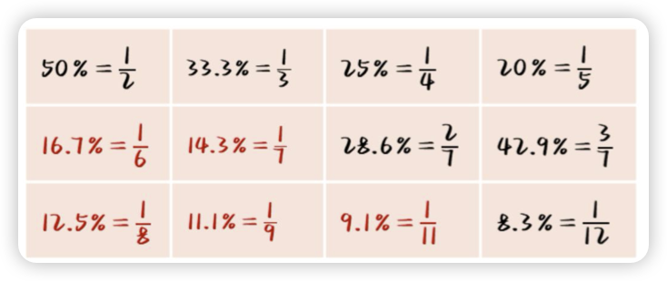
    - **乘法拆分：** 把乘数拆成常见的百分数相乘，再相加。
        - *例：* $592 \times 97\% = 592 \times (100\% - 3\%) = 592 - 17.76 \approx 592 - 18 = 574$

=== "除法"

    - **截位直除法：**
        - **截谁：**
            - 一步除法：整个式子只有【一个除法】，只截【分母】。
            - 多步除法：整个式子是【乘除混合】运算，同截【分子、分母】。
        - **截几位：** (不需要四个选项都看，看最接近的两个选项之间的差距)
            - 截 3 位：选项差距【小】，选项首位【相同】，次位差【小于/等于】首位。
            - 截 2 位：选项差距【大】，选项首位【相同】，次位差【大于】首位 或 选项首位【不同】。
            - **注意：** 选项【量级】不同（比如 10n 倍关系时），截位后要保留量级。
    - **除法拆分：**
        - *例：* $332/688 = (344 - 12)/688 = 50\% - 2\%^- = 48\%^+$
        - 解析：$688 \times 50\% = 344$，688 的 1% 是 6.88，12 不到 6.88 的 2 倍。
    - **常用分数比较：**
        - 分子、分母同大同小 $\rightarrow$ 纵向用直除，横向看倍数。
        - 分子、分母一大一小 $\rightarrow$ 直接看，分子大、分数大。
        - 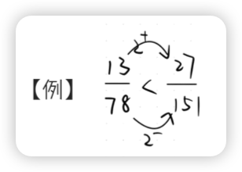

=== "415 份数法"

    - **常用分数表 (R转化)：**
        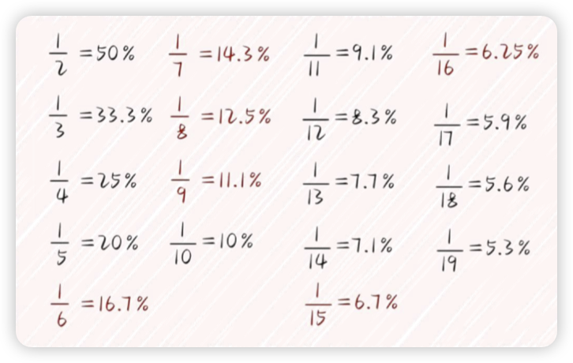
    - **使用步骤：**
        1.  将增长率 $R$ 化成相近的分数 $a/b$。
        2.  基期：变化量：本期量 = $b : a : (a+b)$。
        3.  求得一份量，根据一份量的大小和变化量、基期对应的份数继续求解。

    - **tips:**
        - 基期使用公式：$A = B - X$ (控制误差)
        - 估大则一份变大，估小则一份变小。
        - 增长率为负数时，变化量也为负数，此时变成 $4(-1)3$ 份数法。

=== "假设分配法"

    - **核心思想：** 和拆分一样，都是“抓大放小”，将“大数”分完，“小数”有误差也不影响结果了。
    - **步骤：**
        1.  确定被分配数和增长率。
        2.  画出分配树，确定 A 和 X。
        3.  最后一步直接根据 $X \approx BR$，误差可忽略。
    - **最后一步判断标准：**
        - $R < 20\%$, $X \approx BR$
        - $R$ 在 25% 左右， $A:X = 4:1$
        - $R$ 在 33% 左右， $A:X = 3:1$
        - $R$ 在 50% 左右， $A:X = 2:1$
        - $R$ 在 66% 左右， $A:X = 3:2$
        - $R$ 在 80% 以上，A 和 X 平分再修正。
        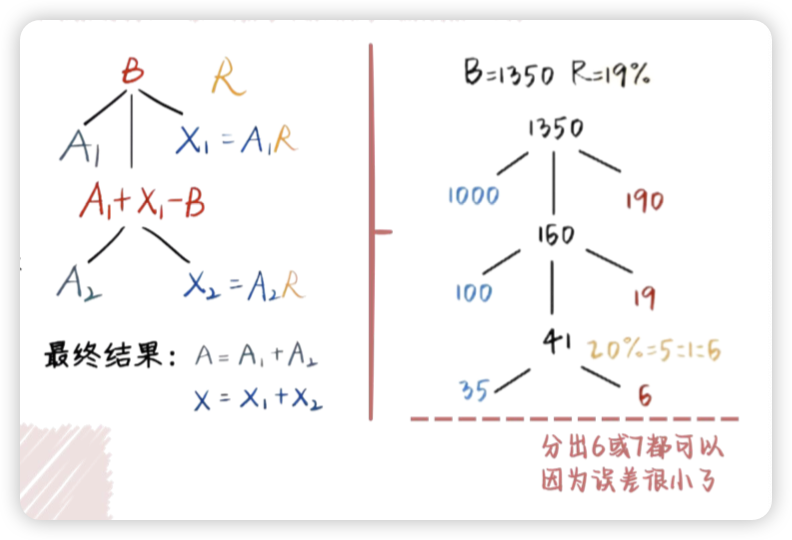

---

## 3. ABRX 类

=== "基期 A"

    - **直接求前期：** 牢记 $A = \frac{B}{1+R} = B - X = \frac{X}{R}$
    - **求隔年前期：** 先用公式求出隔年增长率，再求隔年前期。
    - **求前期差值：** $A_1 - A_2$，分别求出前期做差进行判断。

    ???+ note 
    
        一般基期
        间隔基期
        基期和差
        已知变化变化情况求基期：A=X/R

=== "现期 B"

    - **假设增量求现期：** 先求出 X 的具体值，列出对应不等式即可（列不等式：*当年的量 + n年 × 增量x*）。
    - **假设增速求现期：** $B = A + AR$，依次求出后一年，一般 2 到 3 次即可求得答案。

    ???+ note 

        假设增量求后期
        假设增速求后期
        按照实际增长率求后期
        （根据名义增长率求得基期后，再利用实际增长率求后期）

=== "增长率 R"
    - **一般增长率：** 牢记 $R = \frac{X}{A}$
    - **间隔增长率：** $R_{\text{间}} = R_1 + R_2 + R_1 \times R_2$ (注意可能有逆运用)。
    - **比值增长率：**
        - 符合 $A = B/C$
        - 公式：$Ra = \frac{Rb - Rc}{1 + Rc}$ (均前每后做分母)
        - 比值倍数 = 比值增长率 + 1

    ??? note 

        **人均收入、平均分、单位面积产量、单位面积售价** 等个别的要看公式，如

        “出口量＝ 出口额/出口单价”

        “整体＝部分/占比”

        等问法中往往带“平均”字样

    
    - **乘积增长率：**
        - 符合 $A = B \times C$
        - 公式：$Ra = Rb + Rc + Rb \times Rc$
        - ① $B \times C$ 有实际含义； ② $B \times C$ 表示占比。

    ??? note 

        乘积增长率考察规律：
    
        ①有实际含义的式子：

        - 总产量＝亩产×面积
        - 总销额＝总销量×单价
        - 出口额＝出口量×单价
        - 月产量＝日均产量×天数 等

        ②部分＝整体×占比（尤其注意材料里有某部分占比的图表）

=== "增长量 X"

    - **直接求 X：** $X = B - A = AR$
    - **求两个增长量 X 之间的关系：** 依次求得 $X_1, X_2$。
    - **计算方法：**
        - 选项有一定差距：
            1.  $R \ge 10\%$ 并靠近某个分数，考虑 415 份数法。
            2.  $R < 10\%$，使用假设分配法。
            3.  $R$ 非常小，$R \le 5\%$，$X \approx BR$。
        - 选项间差距较小：
            1.  代入法
            2.  直除

    ??? note 

        一般增长量

        两期增量倍数或比值

        整体增量/部分增量（X＝X1＋X2＋X3…）：各部分增量相加等于总增量

        选项极近时的假设思维（将选项代入计算）

=== "例题"

    ??? example

        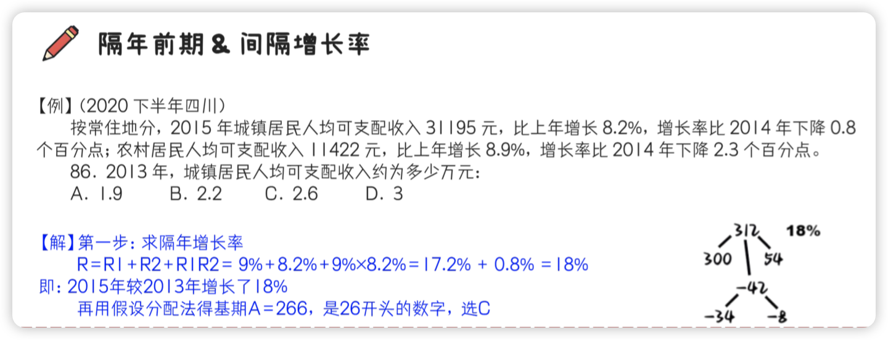
        
        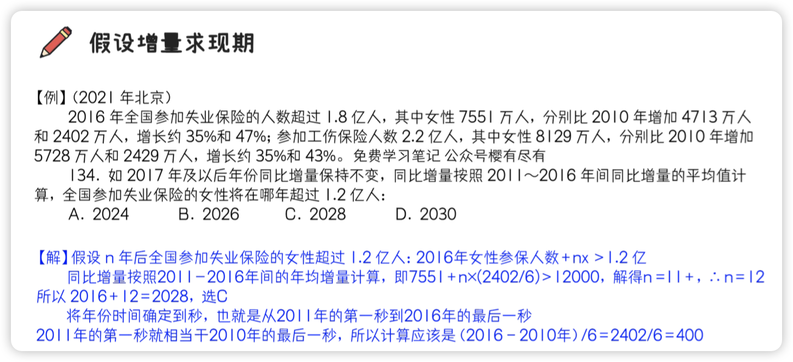
        
        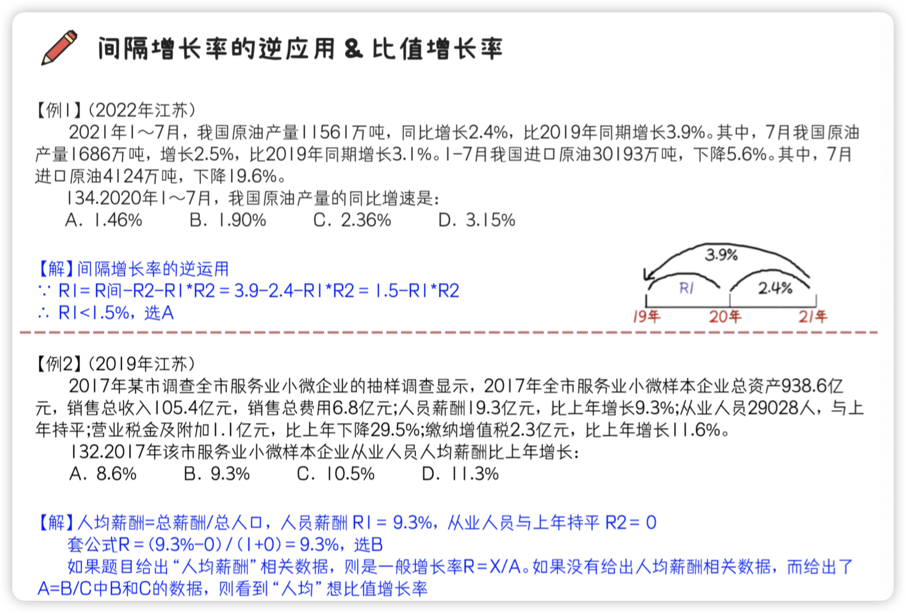

---

## 4. 比重类

!!! bug ""

    平均值、倍数、比值都可以看成比重类问题

=== "基本公式"

    - **本期比重：** $\text{比重} = \frac{\text{部分}}{\text{整体}}$ (多部分比重：$\text{比重和/差} = \frac{\text{部分和/差}}{\text{整体}}$)

    ??? note 

        比重：套用公式即可，比重＝部分/整体、部分＝整体×比重、整体 ＝ 部分/比重；
        
        部分比重和或比重差：套用公式即可，比重和（比重差）＝ 部分和（部分差）/整体；
        
        饼状图：确定各部分所占比例，多利用 1/2、1/3、1/4、1/8 等或两部分之间的倍数关系，注意饼图中各部分的位置关系一般>为从 12 点钟方向起，顺时针依次排列；

    - **基期比重：** $\text{基期比重} = \text{现期比重} \times \frac{1 + R_{\text{整体}}}{1 + R_{\text{部分}}}$
    > *技巧：* 相当于找了一个中间量做过渡。

    ??? note 

        基期比重公式：

        基期比重 = 现期比重 ×整体增长率 + 1/部分增长率 + 1

        记忆口诀：基期比重等于现期比重乘上 1＋增长率反过来。

        基期平均值、基期倍数、基期比值均可看作是“基期比重”，利用基期比重公式进行计算。

    - **隔级比重：** 类似于图示，大圈套中圈，中圈套小圈。
        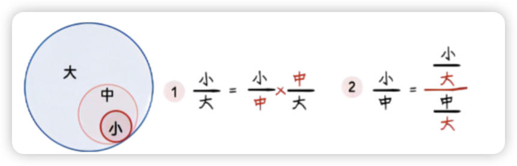

=== "比重趋势"

    - **直接找增长率比较！**
        - 分子的增长率 > 分母，分子涨的快，比重变大。
        - 分子的增长率 < 分母，分子涨的慢，比重变小。
    - **逆运用：** 比重变大，分子涨的快；比重变小，分子涨的慢。

    ??? note 

        分子增速大于分母，则分数变大（比重上升）
        
        分子增速小于分母，则分数变小（比重下降）
        
        比重趋势多一步（给现在的，判断之前的）

=== "比重差"

    - **公式：** $\text{比重差} = \text{本期比重} - \text{基期比重} = \frac{\text{基期部分 } a}{\text{本期整体 } B} \times (R_{\text{部分}} - R_{\text{整体}})$
    - **秒杀技：**
        - 一般来说，$\text{基期部分}/\text{本期整体} < 1$，$\therefore$ 可以用 $\text{比重差} < | \text{增长率之差} |$ 来秒杀。
        - **注意：** *比值差不可秒杀*，因为 $a/B$ 并不一定 $< 1$。
    - **解题步骤：**
        1.  先求出部分增长率 - 整体增长率。
        2.  根据 $R_{\text{部分}} - R_{\text{整体}}$ 判断比重是上升 (>0) 还是下降 (<0)，排除两个选项。
        3.  代入比重差公式计算（计算基期部分时，使用假设分配法第一步就行，误差可以允许）。

    ??? tip 
        记忆口诀：今年的整体分之去年的部分乘上增长率之差
        
        比重差秒杀计：比重差绝对值小于增速差绝对值

=== "比值差"

    | 类型        | 分子分母单位 | 选项单位            | 问法特征                                              | 公式                                                      |
    | :-------- | :----- | :-------------- | :------------------------------------------------ | :------------------------------------------------------ |
    | **比重差** | 相同     | 百分点或 %          | 基期部分 $a$，本期整体 $B$ ... 比重，与上年相比 ... 占比，与上年相比 | $\frac{a}{B} \times (Ra - Rb)$   *可秒杀：* ｜比重差｜< ｜增速差｜ |
    | **比值增长率** | 一般不同   | %               | 满足$C=\frac{A}{B}$  平均、增长率                             | $\frac{Ra - Rb}{1 + Rb}$                                |
    | **比值差** | 一般不同   | 实际量  (例：元/人) | 与上年相比 (例：人均收入与上年相比)                            | $\frac{a}{B} \times (Ra - Rb)$   *不可秒杀-          |
    
    > 例：单价下降最多的是     公式： $\frac{去年出口额 a}{今年出口量 B} × (R 额 - R 量)$

=== "例题"

    ??? example

        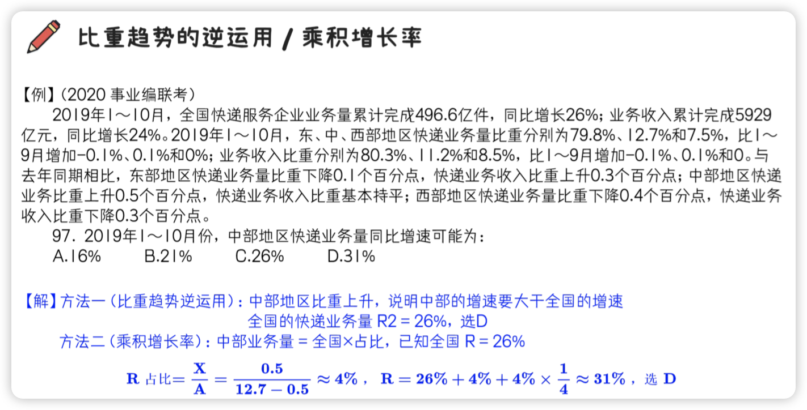
        
        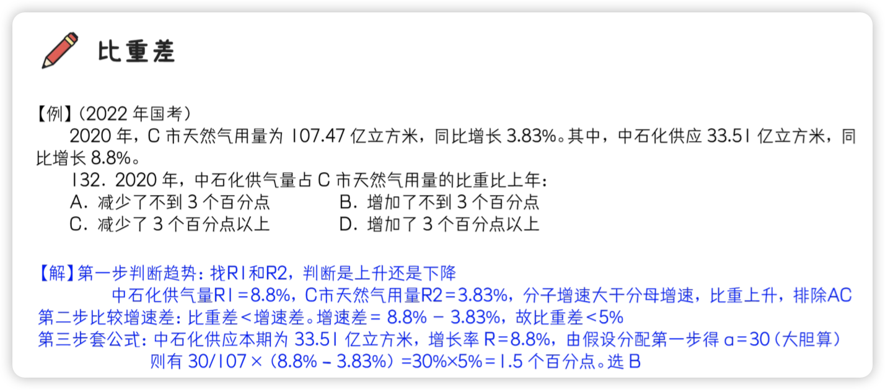
    
---

## 5. 盐水类

=== "十字交叉法"

    !!! bug ""
    
        十字交叉法求出来的是分母之比！

    - **适用前提：** 三量之间存在整体与部分的加和关系。
        - $R = \frac{\text{部分} 1 \times \text{部分} 1 \text{率} + \text{部分} 2 \times \text{部分} 2 \text{率}}{\text{部分} 1 + \text{部分} 2}$
    - **公式：**
  
        $$ \begin{aligned} &\text{溶液 A 浓度} \\ &\text{溶液 B 浓度} \end{aligned} \quad \text{混合溶液浓度 R} \quad \Rightarrow \quad \frac{R - B}{A - R} = \frac{\text{溶液 A 质量}}{\text{溶液 B 质量}} $$
    
    * **应用场景：**
        - 全国 = 城镇 + 农村
        - 居民 = 男性 + 女性
        - 房地产 = 房产 + 地产
        - 进出口 = 进口 + 出口
        - 全部 = 限额以上 + 限额以下
        - 时间分段

    ??? tip

        使用盐水思维常见类型：
        
        - ① 整体增长率和两部分增长率，如进出口额增长率和进口额增长率、出口额增长率
        - ② 累计（累计量=当月量+上月累计量）增长率和两部分（当月量、上月累计量）增长率，如 1～12 月增长率和 1～11 月、> 12 月增长率
        - ③ 整体时间增长率和两部分时间增长率，如上半年增长率和一季度、二季度增长率
        - ④ 主体存在相加关系的增长率，如出口额增长率和贸易顺差、进口额增长率（出口额=贸易顺差+ 进口额）
        - ⑤ 整体平均数和两部分平均数，如全国人均收入和城镇居民人均收入、农村居民人均收入
        - ⑥ 整体比重和两部分比重，如东西部地区城镇化率和东部地区、西部地区城镇化率

=== "定性分析"

    - **原则：** 在中间，不在正中间（混合溶液浓度靠近量大的一方）。
    - **增速大小比较：** *部分 1 > 整体 > 部分 2*
    
    !!! tip ""

        增速相近、R 较小、选项差距大，可用现期代替基期

=== "定量分析"

    #### 增长率相关
    - 已知 3R 求量之比
    - 已知 2R 和量之比，求另一 R
        - $R = X/A$，若代入十字交叉法的是 R，则算出来的是 A (基期) 之比！

    ??? example
    
        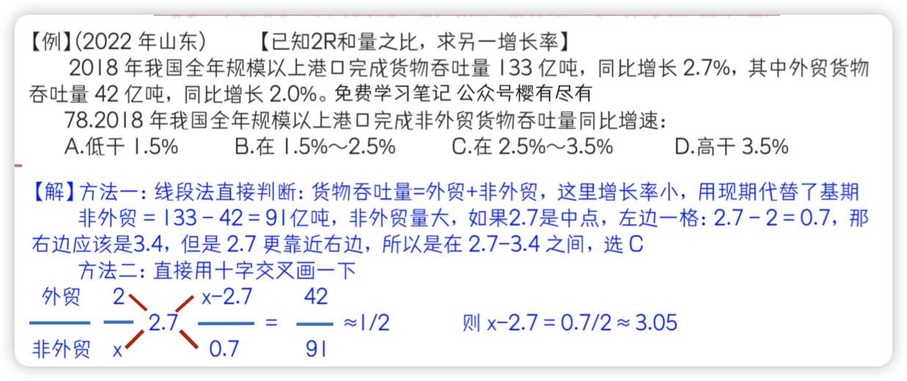

    #### 人数相关
    - 已知某率或某平均数，求人数之比
    - 已知 2R 和量之比，求另一 R
        - $\text{人均} = \text{总量} / \text{总人数}$。若代入十字交叉法的是人均，则算出来的是人数之比！

    ??? example

        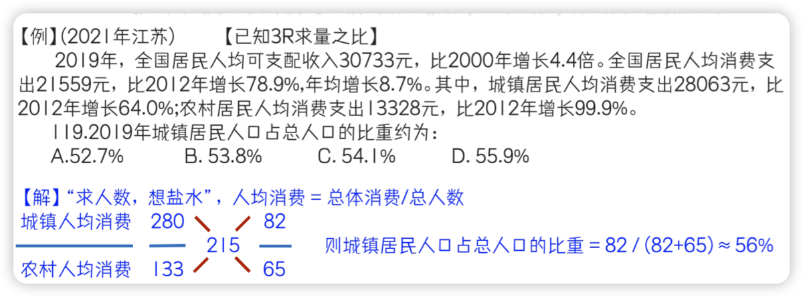

    #### 方法
      - **列公式**：1-12月累计=1-11月累计＋12月
      - **找关系**：R(12月) > R(1-12月累计) > R(1-11月累计)

---

## 6. 比较类

=== "方法"

    - **趋势比较法**：借用比重趋势解题思路，根据分子分母增速大小判断分数大小
        - 子增速（倍数）大于分母，则分数变大
        - 分子增速（倍数）小于分母，则分数变小
    - **通分法**：可将要比较的两个分数的分子或分母换算成同样大小
    - **“王者荣耀”法：**
        - 利用盐水思想，将分子分母同时拆分，可以判断数字是否大于或小于某个数字

=== "比值类 & 双线法"

    - **双线法：**
        - 分数 $\frac{\text{分子}}{\text{分母}}$
        - **适用：** 增长率的大小比较，基期变大，增量变小。
        - **口诀：** 分子、分母画线，看斜率。
        - 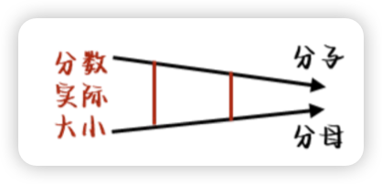

    ??? example

        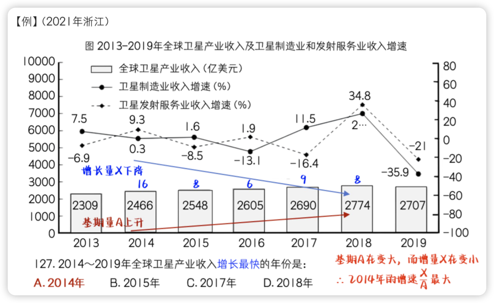

=== "增量比较"

    - **公式 1：** $X = B - A = B \times (1 - \frac{1}{1+R})$
    - **口诀：**
        - **B 越大，R 越大，则增量 X 越大。**
        - B 越大，则左边乘数越大；R 越大，则减掉的部分就越小，则右边乘数越大。
    - **公式 2：**
        - **大大则大，一大一小看倍数：** 我的 B 是你的 n 倍，你的 R 是我的 n 倍以上，我的 X 才可能相等。

    > 注：上面这两句话一般在增速为正 (R > 0) 时使用。

    - **特殊情况：**
        - 增长率超过 10% 的比较有两种方法：
            1. $R = (B-A)/A = X/A > 10\%$
            2. $A + 0.1A < B$

=== "图表查找 (需要注意的坑)"
    1. 注意起始、结束年份、月份。
    2. 注意“合计”、“总计”行，以免数错。
    3. 注意第一年的增量。
    4. 注意单位。

--- 

## 7. 平均类

=== "一般平均值"

    - **口诀：** *均前每后做分母*，“平均每”也是每。
        - ① 时间平均值 $\rightarrow$ 时间范围，起始时间，起始月份。
        - ② 平年 & 闰年 $\rightarrow$ 能被 400 整除，或能被 4 整除但不能被 100 整除的是闰年。
        - ③ 除法转化：$\frac{A}{B} \div \frac{C}{D} = \frac{AD}{BC}$。不着急计算，先观察是否可以约分。

    ??? example

        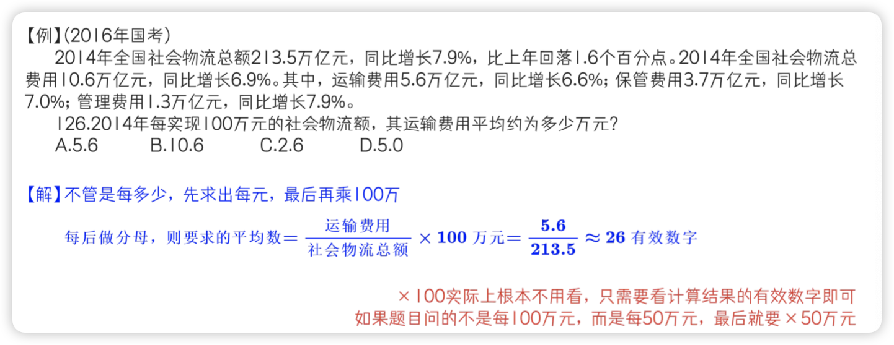

=== "年均增长量"

    - **公式：** $\text{年均增长量} = \frac{\text{末期} - \text{基期}}{\text{年份差 } n}$
    - **最重要：基期是哪一年？**
        - **严谨来说：** 基期应该往前推一年。
            - 例：2020年 ~ 2022年 平均增量 = $\frac{2022\text{年} - 2019\text{年}}{3\text{年}}$
        - **若不严谨：** 基期就按 2020 年来算。
            - 例：2020年 ~ 2022年 平均增量 = $\frac{2022\text{年} - 2020\text{年}}{2\text{年}}$
        - **结论：** 不能直接找到 (推不了)，不推！！！在图表里能直接找出前一年时，推了还有答案，就要推！！！

=== "年均增长率"

    - **公式：** $\text{年均增长率} = (1 + R)^n = \frac{\text{末期}}{\text{基期}}$
    - **当选项极不正常时使用公式：** $\text{末期} / \text{基期} \approx 1 + nR$
    - **记住几个常见的数字：**

    ???+ note inline "三次方"

        * $1.05^3 = 1.16$
        * $1.10^3 = 1.33$
        * $1.15^3 = 1.52$
        * $1.20^3 = 1.73$
        * $1.25^3 = 1.95$
        * $1.30^3 = 2.20$
  
    ???+ abstract inline "四次方"

        * $1.05^4 = 1.216$
        * $1.10^4 = 1.46$
        * $1.15^4 = 1.75$
        * $1.20^4 = 2.07$
        * $1.25^4 = 2.44$
        * $1.30^4 = 2.86$

## 8. 拉动增长、贡献率和容斥问题

=== "拉动增长率 & 增量贡献率"

    - **拉动增长率：** $\text{拉动增长率} = \frac{\text{部分增量}}{\text{整体基期}}$
    - **增量贡献率：** $\text{增量贡献率} = \frac{\text{部分增量}}{\text{整体增量}}$

    ??? example

        

=== "容斥问题"

> 班级有 100 人，男生占 50%，来自南方的同学占 80%

1. **占比和超过 100%，则一定有交集。**
    - 一定有来自南方的男生？
    - 因为 $50\% + 80\% > 100\%$，所以必然有来自南方的男生。

2. **问至多，则考虑比重大的包含比重小的。**
    - 至多有多少南方男生？
    - 让 80% 包含 50%，也就是最多有 50% 的南方男生。

3. **问至少，考虑相斥。** $a + b - 100$ 或者 $a + b - \text{总量}$。
    - 至少有多少南方男生？
    - $80\% + 50\% - 100\% = 30\%$，所以至少有 30% 的南方男生。

--- 